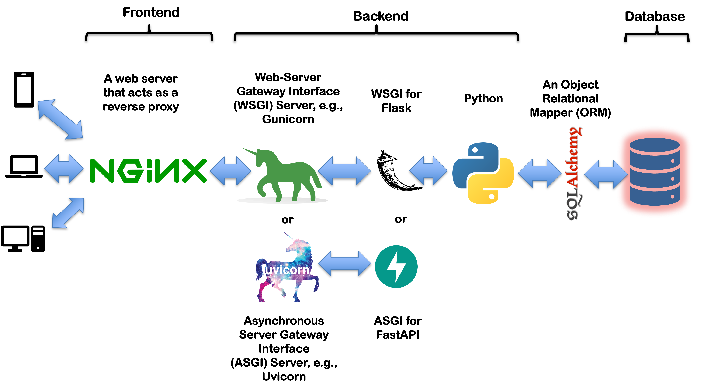

# Object Relational Mapping (ORM)

| Key              | Value                                                                                                                                                                                                                                                                                                                                                          |
|:-----------------|:---------------------------------------------------------------------------------------------------------------------------------------------------------------------------------------------------------------------------------------------------------------------------------------------------------------------------------------------------------------|
| **Course Codes** | DAT 2201, DAT 3103, BBT 3104, MCS 8104, MIT 8107, BBT 4106                                                                                                                                                                                                                                                                                                     |
| **Course Names** | DAT 2201: Database Design and SQL (Week 1-3 of 13), <br/>DAT 3103: Principles of Data Engineering (Week 1-3 of 13), <br/>BBT 3104: Advanced Database Systems (Week 7-9 of 13), <br/>MCS 8104: Database Management Systems (Week 1-3 of 13), <br/>MIT 8107: Advanced Database Systems (Week 1-3 of 13), <br/>BBT 4106: Business Intelligence I (Week 4-6 of 13) |
| **Semester**     | May to July 2026                                                                                                                                                                                                                                                                                                                                               |
| **Lecturer**     | Allan Omondi                                                                                                                                                                                                                                                                                                                                                   |
| **Contact**      | aomondi@strathmore.edu                                                                                                                                                                                                                                                                                                                                         |
| **Note**         | The lecture contains both theory and practice.<br/>This notebook forms part of the practice.<br/>It is intended for educational purpose only.<br/>Recommended citation: [BibTex](https://raw.githubusercontent.com/course-files/ObjectRelationalMapping/refs/heads/main/RecommendedCitation.bib)                                                               |

## Overall Architecture

See [https://github.com/course-files/ServingMLModels](https://github.com/course-files/ServingMLModels) for more information on setting up
a reverse proxy (Nginx) server and a WSGI (Gunicorn) server for a production-ready deployment.



## Repository Structure

```text
.
├── Docker-Compose.yaml
├── LICENSE
├── MySQL_SampleDatabaseTransaction_siwaka_dishes.sql
├── README.md
├── RecommendedCitation.bib
├── assets
│   └── images
│       ├── 1_DataGripTOSQLLite.png
│       ├── 2_CreateTableConfirmation.png
│       ├── 3_Insert_Confirmation.png
│       ├── 4_Automatic-vs-Manual-Transmission.png
│       ├── OverallArchitecture.png
│       ├── activate_venv_pycharm.png
│       ├── activate_venv_vscode.png
│       ├── mysqldump.png
│       └── pexels-antonio-filigno-159809-8538296.jpg
├── container-volumes
│   ├── mysql
│   │   ├── etc-mysql
│   │   │   ├── conf.d
│   │   │   │   ├── docker.cnf
│   │   │   │   └── mysql.cnf
│   │   │   ├── my.cnf
│   │   │   ├── my.cnf.fallback
│   │   │   └── my.cnf.original
│   │   └── init-scripts
│   │       ├── 0.a.DDL_siwaka_dishes_original.sql
│   │       ├── 0.b.siwaka_dishes.png
│   │       ├── 1.a.DML_general_data.sql
│   │       ├── 1.c.DML_employee_data.sql
│   │       ├── 2.b.DML_customer_data.sql
│   │       ├── 3.b.DML_customerOrder_data.sql
│   │       ├── 4.b.DML_orderDetail_data.sql
│   │       ├── 5.b.DML_payment_data.sql
│   │       ├── 6.b.DML_customerfeedback_data.sql
│   │       ├── 7.a.DML_other_DB_objects.sql
│   │       ├── classicmodels.png
│   │       ├── classicmodels.sql
│   │       ├── dreamhome.png
│   │       └── dreamhome.sql
│   └── postgresql
│       ├── etc-postgresql
│       │   ├── pg_hba.conf
│       │   └── postgresql.conf
│       └── init-scripts
│           ├── 0.a.DDL_siwaka_dishes_original.sql
│           ├── 0.b.siwaka_dishes.png
│           ├── 1.a.DML_general_data.sql
│           ├── 1.c.DML_employee_data.sql
│           ├── 2.b.DML_customer_data.sql
│           ├── 3.b.DML_customerOrder_data.sql
│           ├── 4.b.DML_orderDetail_data.sql
│           ├── 5.b.DML_payment_data.sql
│           ├── 6.b.DML_customerfeedback_data.sql
│           ├── 7.a.DML_other_DB_objects.sql
│           ├── classicmodels.png
│           ├── classicmodels.sql
│           ├── dreamhome.png
│           └── dreamhome.sql
├── database_backup_and_recovery.md
├── images
│   └── mysql
│       └── Dockerfile
├── lab_submission_instructions.md
├── model
├── queries
├── requirements.txt
├── sample_application
│   ├── backend
│   │   ├── app.py
│   │   ├── db.py
│   │   ├── models.py
│   │   └── services.py
│   └── frontend
│       ├── meal_order_transaction.html
│       └── process_order.html
├── setup_instructions.md
├── sql_alchemy_part1.ipynb
├── sql_alchemy_part2.ipynb
├── sql_alchemy_part3.ipynb
├── sql_alchemy_part4.ipynb
└── temporary

18 directories, 65 files
```

## Setup Instructions

- [Setup Instructions](setup_instructions.md)

## Lab Manual

Refer to the files below for more details:

1. [sql_alchemy_part1.ipynb](sql_alchemy_part1.ipynb)
2. [sql_alchemy_part2.ipynb](sql_alchemy_part2.ipynb)
3. [sql_alchemy_part3.ipynb](sql_alchemy_part3.ipynb)
4. [sql_alchemy_part4.ipynb](sql_alchemy_part4.ipynb)
5. [process_order.html](sample_application/frontend/process_order.html)
6. [MySQL_SampleDatabaseTransaction_siwaka_dishes.sql](MySQL_SampleDatabaseTransaction_siwaka_dishes.sql)

7. [services.py](sample_application/backend/services.py): **This is the backend**. It implements the business rules and transaction logic.
8. [db.py](sample_application/backend/db.py): This forms **part of the ORM layer**. It specifies how to connect to the database.
9. [models.py](sample_application/backend/models.py): This forms **part of the ORM layer**. It defines the database schema and maps Python objects to database tables.
10. [app.py](sample_application/backend/app.py): This **exposes the backend** to the outside world through API endpoints.
11. [meal_order_transaction.html](sample_application/frontend/meal_order_transaction.html): This is a sample frontend interface that interacts with the backend through the API endpoints.
12. [database_backup_and_recovery.md](database_backup_and_recovery.md)

By separating `services.py` from `db.py` + `models.py`, you get:

- Reusable business logic independent of the database.
- A clear layer for testing: you can unit-test the backend logic without involving a specific database system.
- A clear ORM layer that can be swapped out for another database without rewriting your service logic.

This is classic, traditional layering, which scales far better than putting everything in one file and creating _"spaghetti code"_ that is challenging to maintain.

## Lab Submission Instructions

- [Lab Submission Instructions](lab_submission_instructions.md)
