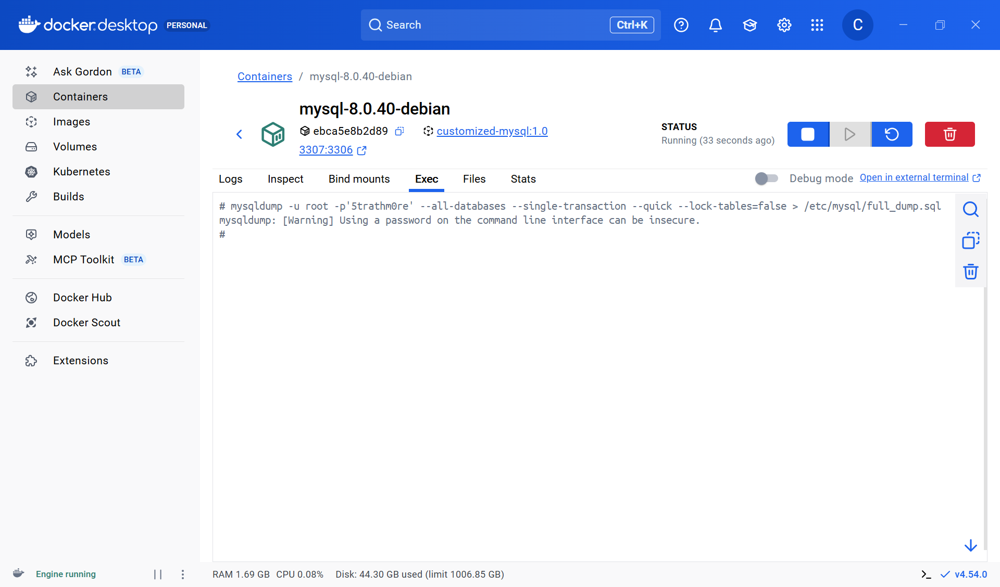

# Database Backup and Recovery

| Key              | Value                                                                                                                                                                                                                                                                                            |
|:-----------------|:-------------------------------------------------------------------------------------------------------------------------------------------------------------------------------------------------------------------------------------------------------------------------------------------------|
| **Course Codes** | MIT 8107                                                                                                                                                                                                                                                                                         |
| **Course Names** | MIT 8107: Advanced Database Systems (Week 1-3 of 13)                                                                                                                                                                                                                                             |
| **Semester**     | May to July 2026                                                                                                                                                                                                                                                                                 |
| **Lecturer**     | Allan Omondi                                                                                                                                                                                                                                                                                     |
| **Contact**      | aomondi@strathmore.edu                                                                                                                                                                                                                                                                           |
| **Note**         | The lecture contains both theory and practice.<br/>This notebook forms part of the practice.<br/>It is intended for educational purpose only.<br/>Recommended citation: [BibTex](https://raw.githubusercontent.com/course-files/ObjectRelationalMapping/refs/heads/main/RecommendedCitation.bib) |

You did not merely “stop the server”; you interrupted InnoDB in the middle of its assigned processing task.

When you "brutally" (not gracefully) stopped the server during an uncommitted transaction, you likely corrupted the InnoDB data dictionary or a foreign key metadata structure. The error log confirms this with the statement `Assertion failure: dict0dict.cc:3480:for_table || ref_table`.

This is not a warning. This is InnoDB deliberately crashing itself because it detected internal inconsistency in the data dictionary while trying to recover transactions and foreign key metadata.

Rather than continuing in a corrupted state, InnoDB deliberately crashes itself. Then Docker restarts the MySQL container (`restart: always` command in [Docker-Compose.yaml](Docker-Compose.yaml)) and the cycle repeats in a loop.

**Lesson to learn:** An “uncommitted transaction” DOES NOT imply “safe to kill.”

## Step 1: Stop the Restart Loop Temporarily
Edit [Docker-Compose.yaml](Docker-Compose.yaml) and change the MySQL container's `restart: always` command to `restart: no`

## Step 2: Enable Forced InnoDB Recovery
Edit [my.cnf](container-volumes/mysql/etc-mysql/my.cnf) and add the following line under the [mysqld] section:

```ini
[mysqld]
innodb_force_recovery = 1
```

If it still crashes, then increment **gradually**:

_Analogy: Like gears when driving a manual car._

```ini
[mysqld]
innodb_force_recovery = 2
```
```ini
[mysqld]
innodb_force_recovery = 3
```
```ini
[mysqld]
innodb_force_recovery = 4
```

- Avoid the higher levels (>=4) unless desperate because they are extraction modes, not repair modes. This means that they can cause data loss.
- **Note:** Never run `innodb_force_recovery` in production. Disable it once it has served its purpose.

## Step 3: Start the MySQL Container

Start the MySQL container using [Docker-Compose.yaml](Docker-Compose.yaml).

## Step 4: Immediately Dump the Database and then Stop the Container
Once the MySQL container is running, immediately dump all the databases, including the `siwaka_dishes` database, using the following command:

```shell
mysqldump -u root -p'5trathm0re' --all-databases --single-transaction --quick --lock-tables=false > /etc/mysql/full_dump.sql
```



## Step 5: Delete the Corrupted Database Files and Disable `innodb_force_recovery` in [my.cnf](container-volumes/mysql/etc-mysql/my.cnf)
- We need to start by removing the corrupted database files.
- The default location of the database files is `/var/lib/mysql`. Remember that 
the `container-volumes/mysql/var-lib-mysql` folder in the host was mapped to `/var/lib/mysql` inside the container.
- We can use the `rm` command to remove the corrupted database files.
```shell
rm -rf /var/lib/mysql/*
```
- Or, alternatively, delete the contents of `container-volumes/mysql/var-lib-mysql` from the host.
- Then we can restore the database using the dump we just created.

## Step 6: Restart the MySQL Container
- Restart the MySQL container using [Docker-Compose.yaml](Docker-Compose.yaml).
- Then execute the following command to restore the database:
```shell
mysql -u root -p'5trathm0re' < /etc/mysql/full_dump.sql
```
- Confirm that the database is restored correctly by running the following command:

## Step 7: Gracefully Restart the MySQL Container
- A graceful restart means that the server is allowed to finish what it is doing,
flush its state, and shut down cleanly before coming back up. 
- Anything else is brute force.
- The following command should be used:

```shell
mysqladmin -u root -p'5trathm0re' shutdown
```

## Step 8: Configure Automatic Backup
- As simulated in this lab, it is easy to corrupt the database files and lose all your data.
- This happened when we "brutally" stopped the server during an uncommitted transaction.
- We were not able to quickly restore the database because we did not have any backups.
- We had to create the backup manually under duress.
- **Lesson to learn:** Always have periodic backups of your data.

- Add the following to [Docker-Compose.yaml](Docker-Compose.yaml):

```yaml
  mysql_backup:
    image: customized-mysql:1.0
    build:
      context: ./images/mysql
      dockerfile: Dockerfile
    hostname: mysql_backup
    container_name: mysql_backup
    # restart: no → The default. The container runs once. If it stops, then it stays stopped.
    # restart: always → The container always runs, even after the host machine restarts.
    # restart: on-failure → The container restarts only if it exists with a non-zero exit code.
    # restart: on-failure:5 → The container restarts only if it exists with a non-zero exit code, but it is restarted up to a maximum of 5 times in a row.
    # restart: unless-stopped → The container always restarts unless it is manually stopped.
    restart: unless-stopped
    depends_on:
      - mysql-8.0.40-debian
    volumes:
      # To store the server's backups persistently in the host
      - mysql-backup:/backup/mysql/
      # Secret file containing the credentials to access the MySQL server
      - mysql-secrets:/root/
      # `sleep 30` (30 seconds) provides a startup delay to give the MySQL server time to start
      # before the first backup is initiated.

      # `sleep 10800` (3 hours) provides a periodic backup interval that repeats forever,
      # as long as the container is running.
      # ----------- We can change this to `sleep 120` for teaching purposes, i.e., perform the backups every 2 minutes.

      # Retention Policy for the Backups (to avoid filling up the storage space):
      # Best Practice: Retention policies should be enforced by the storage layer, not in a shell loop inside the container.

      # `find /backup/mysql -type f -name '*.sql' -mtime +7 -print -delete >> $$LOG_FILE 2>&1;`
      # ----------- We can change this to `find /backup/mysql -type f -name '*.sql' -mmin +2 -print -delete >> $$LOG_FILE 2>&1;` for files older than 2 minutes.
        # -mtime +7 → finds files older than 7 days (assuming that you will not take more than 7 days to notice corrupted databases).
        # -type f → finds only files, not directories.
        # -name '*.sql' → only database dumps.
        # -delete → simple, permanent deletion without any confirmation.
        # -print → prints the names of the files that would be deleted (basic logging).
        # $$LOG_FILE 2>&1; → Take errors and send them to the same place as the normal output.
    command: >
      /bin/bash -c "
      LOG_FILE=/backup/mysql/backup.log;
    
      touch $$LOG_FILE &&
      chmod 600 /root/.my.cnf &&
      sleep 30 &&
    
      while true; do
        echo \"[$(date '+%Y-%m-%d %H:%M:%S')] Backup started\" >> $$LOG_FILE;
    
        if mysqldump --all-databases --single-transaction --quick --lock-tables=false > /backup/mysql/full_dump_$(date +%Y%m%d_%H%M).sql; then
    
          echo \"[$(date '+%Y-%m-%d %H:%M:%S')] Backup completed successfully\" >> $$LOG_FILE;
    
          find /backup/mysql -type f -name '*.sql' -mtime +7 -print -delete >> $$LOG_FILE 2>&1;
    
          echo \"[$(date '+%Y-%m-%d %H:%M:%S')] Backup retention policy enforced\" >> $$LOG_FILE;
    
        else
          echo \"[$(date '+%Y-%m-%d %H:%M:%S')] ERROR: Backup failed\" >> $$LOG_FILE;
        fi
    
        sleep 10800;
      done
      "

volumes:
  mysql-backup:
    driver: local
    driver_opts:
      type: none
      o: bind
      device: ./container-volumes/backup/mysql/
  mysql-secrets:
    driver: local
    driver_opts:
      type: none
      o: bind
      device: ./container-volumes/docker-secrets/mysql/
```

- We also need to stop providing the password in plaintext in the terminal.
- Instead, we will use a secret file to store the password.
- Create a file named `.my.cnf` in the `./container-volumes/docker-secrets/mysql/` folder and add the following content:

```ini
[client]
user = root
password = 5trathm0re
host = mysql-8.0.40-debian
port = 3306

# Remember to execute the following on the host:
# chmod 600 container-volumes/docker-secrets/mysql/.my.cnf
```

- The `.my.cnf` file will enable ut to execute the following without having to specify
the username and the password every time:

```shell
mysqldump --all-databases --single-transaction --quick --lock-tables=false > /backup/mysql/full_dump_$(date +%Y%m%d_%H%M).sql
```